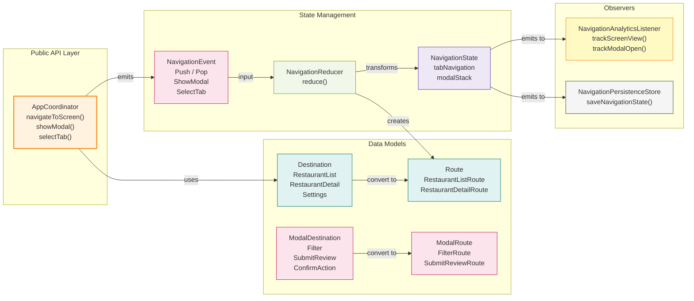
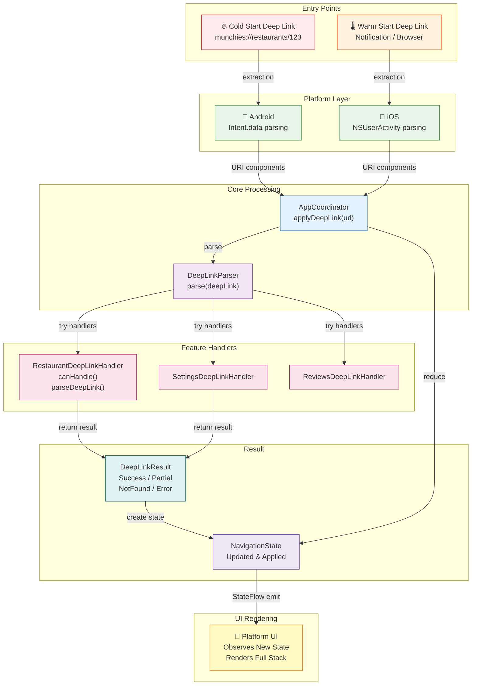
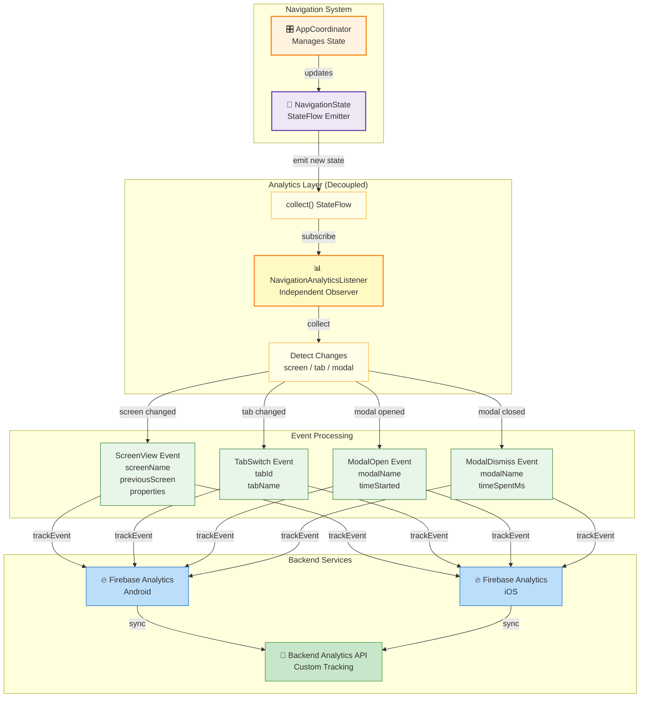
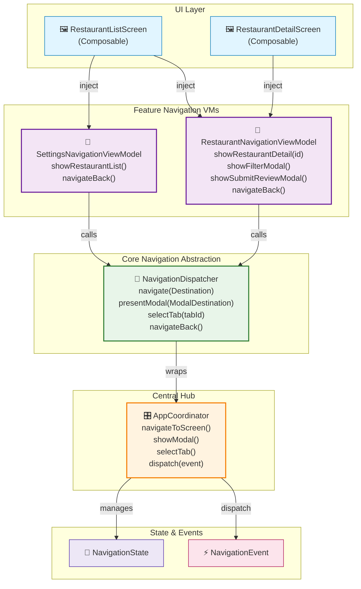
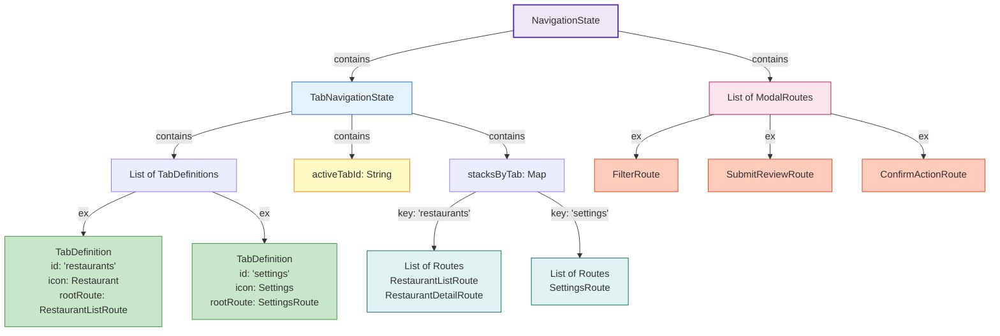
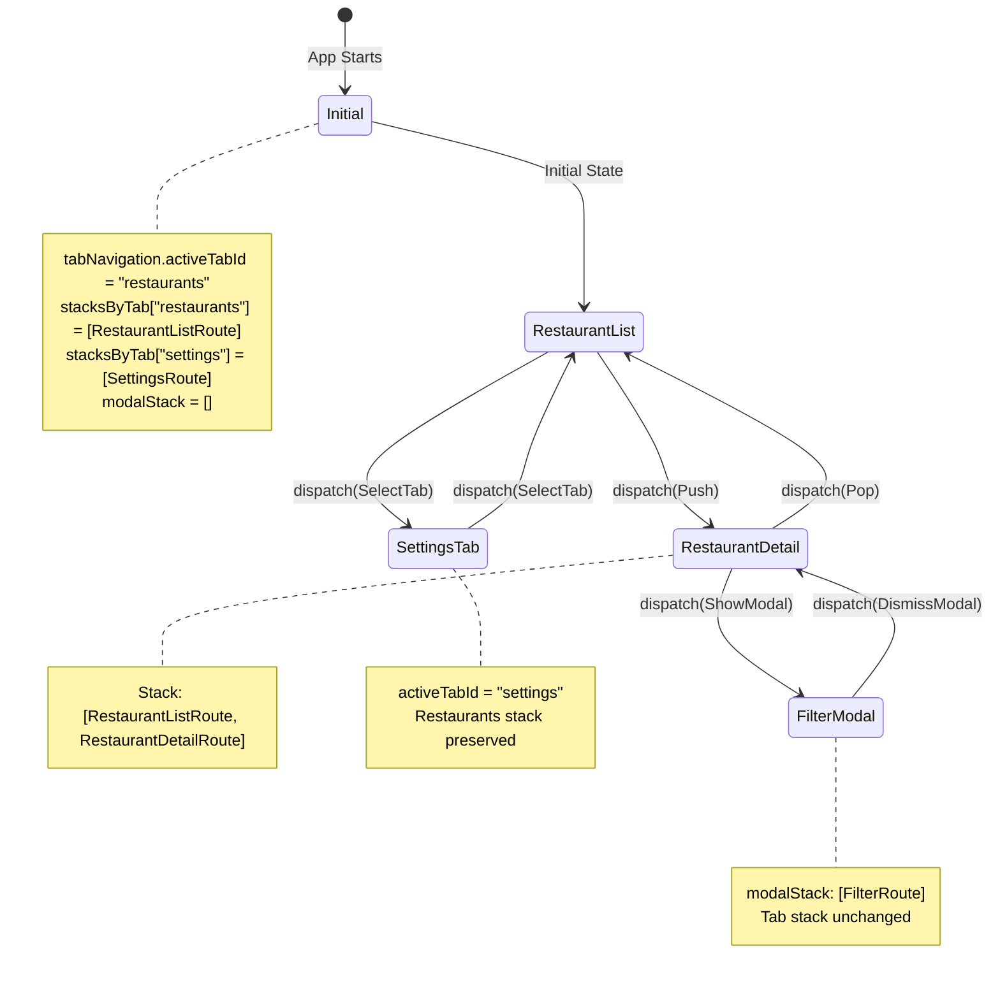

# Navigation Architecture Guide

**Last Updated:** May 18, 2026  
**Status:** Current Implementation Analysis  
**Framework:** Kotlin Multiplatform Mobile (KMM) with Compose/SwiftUI

---

## Table of Contents

1. [Overview](#overview)
2. [Core Architecture](#core-architecture)
3. [Navigation System Components](#navigation-system-components)
4. [Deep Link Handling](#deep-link-handling)
5. [Analytics Integration](#analytics-integration)
6. [Shared View Models & Navigation](#shared-view-models--navigation)
7. [How to Navigate](#how-to-navigate)
8. [Code Examples](#code-examples)

---

## Overview

The Munchies mobile app uses a **Redux-inspired, platform-agnostic navigation architecture** built on KMM. The system is designed to:

- ✅ **Centralize navigation state** in a single source of truth (`AppCoordinator`)
- ✅ **Support multiple navigation patterns**: screen stacks, tab switching, modals, and deep links
- ✅ **Enable deep link handling** with full navigation state restoration
- ✅ **Gather navigation analytics** about screen transitions and user flows
- ✅ **Trigger navigation from shared view models** using a clean abstraction layer
- ✅ **Work identically across Android and iOS** with native UI frameworks

---

## Core Architecture

### Architecture Pattern: Redux + Observer

The navigation system follows these key patterns:

```
┌─────────────────────────────────────────────────────┐
│  User Action / Event (e.g., "Tap Restaurant Card") │
└────────────────────┬────────────────────────────────┘
                     │
                     ▼
┌─────────────────────────────────────────────────────┐
│  AppCoordinator: dispatch(NavigationEvent)          │
│  - Receives events                                   │
│  - Invokes NavigationReducer                        │
└────────────────────┬────────────────────────────────┘
                     │
                     ▼
┌─────────────────────────────────────────────────────┐
│  NavigationReducer: Pure State Transformation       │
│  (NavigationState, NavigationEvent) -> NavigationState
└────────────────────┬────────────────────────────────┘
                     │
                     ▼
┌─────────────────────────────────────────────────────┐
│  AppCoordinator: Emit New State                     │
│  - Update internal StateFlow<NavigationState>       │
│  - Create Koin scopes for new routes                │
│  - Close Koin scopes for removed routes             │
└────────────────────┬────────────────────────────────┘
                     │
          ┌───────────┼───────────┐
          │           │           │
          ▼           ▼           ▼
     Platform UI   Analytics   Persistence
    (Android/iOS)  Listener    Store
```

**Mermaid Diagram: Full Navigation Flow**

```mermaid
graph TB
    subgraph "User Layer"
        U["🖱️ User Action<br/>(Tap Card, Button, etc)"]
    end
    
    subgraph "Feature Layer"
        FVM["📱 Feature NavigationViewModel<br/>(RestaurantNavigationViewModel)"]
        FVM1["showRestaurantDetail()"]
    end
    
    subgraph "Core Navigation Layer"
        ND["🔄 NavigationDispatcher<br/>(Generic Abstraction)"]
        AC["🎛️ AppCoordinator<br/>(Central Hub)"]
        NE["⚡ NavigationEvent<br/>(Push, Pop, ShowModal, etc)"]
    end
    
    subgraph "Redux Layer"
        NR["🔀 NavigationReducer<br/>(Pure Functions)"]
        NS["💾 NavigationState<br/>(Immutable Tree)"]
    end
    
    subgraph "Observers"
        PUI["🎨 Platform UI<br/>(Compose/SwiftUI)"]
        ANA["📊 Analytics Listener<br/>(Tracks Events)"]
        PS["💿 Persistence Store<br/>(Saves State)"]
    end
    
    U -->|triggers| FVM1
    FVM1 -->|calls| FVM
    FVM -->|navigate| ND
    ND -->|wraps| AC
    AC -->|dispatch| NE
    NE -->|input| NR
    NR -->|(State, Event)→NewState| NS
    NS -->|updates| AC
    AC -->|emits| PUI
    AC -->|emits| ANA
    AC -->|emits| PS
    
    style U fill:#e1f5ff
    style FVM fill:#f3e5f5
    style FVM1 fill:#f3e5f5
    style ND fill:#e8f5e9
    style AC fill:#fff3e0
    style NE fill:#fce4ec
    style NR fill:#f1f8e9
    style NS fill:#ede7f6
    style PUI fill:#e0f2f1
    style ANA fill:#fff9c4
    style PS fill:#f5f5f5
```

### Key Characteristics

| Aspect | Details |
|--------|---------|
| **Pattern** | Redux + Observer Pattern |
| **State Management** | Centralized in `AppCoordinator` via `StateFlow<NavigationState>` |
| **Event Handling** | Pure reducer functions (no side effects) |
| **Platform Layer** | Platform-specific UI receives state updates, not navigation commands |
| **Coupling** | Loose: Analytics and persistence are decoupled from coordinator |
| **Scope Management** | Koin scopes created/destroyed per route lifecycle |

---

## Navigation System Components

### Component Architecture Diagram



### 1. **AppCoordinator** (`AppCoordinator.kt`)

**Purpose:** Central coordinator for all navigation in the application.

**Responsibilities:**
- Manages navigation state (`NavigationState`)
- Dispatches navigation events
- Reduces events to new state via `NavigationReducer`
- Creates/destroys Koin scopes for routes
- Persists navigation state (optional)
- Provides listener readiness callbacks for platform layers

**Key Methods:**

```kotlin
// Screen navigation
fun navigateToScreen(destination: Destination)
fun navigateToRestaurantDetail(restaurantId: String)
fun navigateBack()
fun navigateToRoot()

// Modal navigation
fun showModal(destination: ModalDestination)
fun showFilterModal(preSelectedFilters: List<String> = emptyList())
fun submitReview(restaurantId: String)
fun dismissModal()
fun dismissAllModals()

// Tab navigation
fun selectTab(tabId: String)
fun navigateInTab(destination: Destination)
fun backInTab()

// Deep linking
fun applyDeepLink(deepLink: String)
fun applyNavigationState(newState: NavigationState, clearCurrentStack: Boolean = true)

// State access
fun getCurrentState(): NavigationState

// Listener readiness (for platform layers)
fun onListenerReady(action: () -> Unit)
fun markListenerReady()
```

**Public Properties:**

```kotlin
val navigationState: StateFlow<NavigationState>  // Read-only state emissions
val navigationEvents: SharedFlow<NavigationEvent> // Raw navigation events (replay = 1)
```

### 2. **NavigationState** (`NavigationState.kt`)

**Purpose:** Immutable representation of the entire navigation state tree.

**Structure:**

```kotlin
data class NavigationState(
    val tabNavigation: TabNavigationState,
    val modalStack: List<ModalRoute> = emptyList()
)

// Tab-based navigation
data class TabNavigationState(
    val tabDefinitions: List<TabDefinition>,
    val activeTabId: String,
    val stacksByTab: Map<String, List<Route>>
)

data class TabDefinition(
    val id: String,
    val label: String,
    val icon: IconId,
    val rootRoute: Route
)
```

**Key Feature:** Supports parallel stacks for each tab, preserving user context when switching between tabs.

### 3. **NavigationEvent** (`NavigationEvent.kt`)

**Purpose:** Sealed class representing all possible user intents/navigation actions.

**Event Types:**

```kotlin
sealed class NavigationEvent {
    // Screen navigation
    data class Push(val destination: Destination)
    data object Pop
    data object PopToRoot
    
    // Modal navigation
    data class ShowModal(val destination: ModalDestination)
    data object DismissModal
    data object DismissAllModals
    data class DismissModalUntil(val predicate: (ModalRoute) -> Boolean)
    
    // Tab navigation
    data class SelectTab(val tabId: String)
    data class PushInTab(val destination: Destination)
    data object PopInTab
    
    // Deep linking
    data class ApplyNavigationState(val newState: NavigationState, val clearCurrentStack: Boolean = true)
}
```

### 4. **NavigationReducer** (`NavigationReducer.kt`)

**Purpose:** Pure functions that transform state based on events.

**Key Principle:** `(State, Event, Handlers) -> State`

**Handlers:**
- `handlePush()` - Navigate to a new screen
- `handlePop()` - Go back (from modal or tab stack)
- `handleShowModal()` - Show modal overlay
- `handleDismissModal()` - Dismiss top modal
- `handleSelectTab()` - Switch active tab
- And more...

**Important:** All functions are **pure** - no side effects, no I/O operations.

### 5. **Destination & Routes** (`Destination.kt` / `Routes.kt`)

**Destination** (Type-safe sealed class for screens):

```kotlin
sealed class Destination {
    data object RestaurantList : Destination()
    data class RestaurantDetail(val restaurantId: String) : Destination()
    data object Settings : Destination()
}
```

**Route** (Serializable, for persistence and state storage):

```kotlin
@Serializable
data class RestaurantListRoute(
    override val key: String = KEY
) : Route() {
    @Transient override val isRootRoute: Boolean = true
    @Transient override val scopeQualifier: String = "RestaurantListScope"
}

@Serializable
data class RestaurantDetailRoute(
    val restaurantId: String
) : Route() {
    override val key: String = "${KEY_PREFIX}$restaurantId"
    @Transient override val isRootRoute: Boolean = false
}
```

**Conversion:**
```kotlin
fun Route.toDestination(): Destination? // Route -> Destination (for UI layer)
```

### 6. **ModalDestination & ModalRoutes** (`NavigationEvent.kt` / `ModalRoutes.kt`)

**Purpose:** Similar to `Destination` but specifically for modal overlays.

**Supported Modals:**

```kotlin
sealed class ModalDestination {
    data class Filter(val preSelectedFilters: List<String> = emptyList()) : ModalDestination()
    data class ConfirmAction(val message: String, val confirmText: String = "OK", val cancelText: String = "Cancel") : ModalDestination()
    data class DatePicker(val initialDate: String? = null) : ModalDestination()
    data class SubmitReviewModal(val restaurantId: String) : ModalDestination()
    data object ReviewSuccessModal : ModalDestination()
    data class ReviewErrorAlert(val message: String) : ModalDestination()
}
```

---

## Deep Link Handling

### System Overview

The deep link system enables:
- 🔗 **Cold start deep links** (app not running)
- 🔗 **Warm deep links** (app already running)
- 🔗 **Complex navigation state restoration** (full stack recreation)
- 🔗 **Query parameter parsing** (filters, pre-selected values, etc.)

### Deep Link Processing Flow



### Components

#### 1. **DeepLinkHandler** (Interface)

**Purpose:** Each feature implements its own deep link handler.

```kotlin
interface DeepLinkHandler {
    fun canHandle(deepLink: String): Boolean
    fun parseDeepLink(deepLink: String): DeepLinkResult
}
```

**Implementations:**
- `RestaurantDeepLinkHandler` (feature-restaurant)
- `SettingsDeepLinkHandler` (feature-settings)
- `ReviewsDeepLinkHandler` (feature-restaurant)

#### 2. **DeepLinkParser** (`DeepLinkParser.kt`)

**Purpose:** Coordinates all handlers to parse a deep link URL.

```kotlin
class DeepLinkParser(private val handlers: List<DeepLinkHandler>) {
    fun parse(deepLink: String): DeepLinkResult {
        // Tries each handler until one succeeds or all fail
    }
}
```

#### 3. **DeepLinkProcessor** (`DeepLinkProcessor.kt`)

**Purpose:** Platform-agnostic processor for route pattern matching and coordinator dispatch.

**Input:** Parsed URI components (host, path, query params)  
**Output:** Coordinator method calls (identical across platforms)

```kotlin
object DeepLinkProcessor {
    fun processDeepLink(
        host: String,
        pathSegments: List<String>,
        queryParams: Map<String, String>,
        coordinator: AppCoordinator
    )
}
```

#### 4. **DeepLinkConstants** (`DeepLinkConstants.kt`)

**Purpose:** Centralized constants for deep link handling.

```kotlin
object DeepLinkConstants {
    // Hosts
    const val HOST_RESTAURANTS = "restaurants"
    const val HOST_SETTINGS = "settings"
    const val HOST_MODAL = "modal"
    
    // Paths
    const val PATH_FILTER = "filter"
    const val PATH_SUBMIT_REVIEW = "submit_review"
    
    // Query parameters
    const val QUERY_PARAM_FILTERS = "filters"
}
```

### Supported Deep Links

**Example Deep Links:**

```
munchies://restaurants                              # Navigate to restaurant list
munchies://restaurants/{restaurantId}               # Navigate to restaurant detail
munchies://settings                                 # Navigate to settings
munchies://modal/filter?filters=tag1,tag2           # Show filter modal with pre-selected filters
munchies://modal/submit_review/{restaurantId}       # Show review submission modal
munchies://modal/confirm?message=...                # Show confirmation dialog
munchies://modal/date_picker?initialDate=2026-05-18 # Show date picker
```

### How Deep Links Work

#### Flow for Cold Start (App Not Running)

```
1. User taps deep link from notification/browser
2. Platform (Android/iOS) extracts URI components
3. Platform calls coordinator.applyDeepLink(url)
4. DeepLinkParser tries each DeepLinkHandler
5. Handler returns DeepLinkResult with NavigationState
6. AppCoordinator reduces state with ApplyNavigationState event
7. UI observes new state and renders entire stack
```

#### Flow for Warm Start (App Already Running)

```
1. User taps deep link while app is active
2. Platform calls coordinator.applyDeepLink(url)
3. Same process as cold start (platform independent)
4. Current state is replaced or merged (based on clearCurrentStack flag)
```

### DeepLinkResult Types

```kotlin
sealed class DeepLinkResult {
    data class Success(val navigationState: NavigationState, val clearCurrentStack: Boolean) : DeepLinkResult()
    data class Partial(val navigationState: NavigationState, val clearCurrentStack: Boolean) : DeepLinkResult()
    data class NotFound(val link: String) : DeepLinkResult()
    data class Error(val link: String, val exception: Throwable) : DeepLinkResult()
}
```

---

## Analytics Integration

### System Overview

The analytics system tracks:
- 📊 **Screen views** (when transitioning between screens)
- 📊 **Tab switches** (when switching between tabs)
- 📊 **Modal open/close events** (with time spent in modal)
- 📊 **Previous screen** (for understanding user flow)

### Analytics Observer Pattern Architecture



**Key Design Principle:** Analytics is **completely decoupled** from AppCoordinator using the Observer Pattern. The listener independently subscribes to state changes without any involvement from the coordinator.

### Architecture

**Key Design Decision:** Analytics is **decoupled from AppCoordinator** using the Observer Pattern.

```
NavigationAnalyticsListener (Observer)
         ↓
    Observes: StateFlow<NavigationState>
         ↓
    Detects changes (via collect)
         ↓
    Calls: analyticsService.trackEvent(...)
         ↓
    No coupling to AppCoordinator internals
```

**Why this approach?**

1. ✅ **Decoupled:** Analytics listener can be created/destroyed independently
2. ✅ **Simpler lifecycle:** No need to pass through coordinator initialization
3. ✅ **Single responsibility:** Coordinator doesn't know about analytics
4. ✅ **Thread-safe:** State changes processed by listener's internal coroutine
5. ✅ **Easy to test:** Mock analytics service independently

### Components

#### 1. **NavigationAnalyticsListener** (`NavigationAnalyticsListener.kt`)

**Purpose:** Observes navigation state changes and emits analytics events.

**Responsibilities:**
- Subscribe to `navigationState: StateFlow<NavigationState>`
- Detect screen changes, tab switches, modal opens/closes
- Calculate time spent in modals
- Extract route properties (e.g., restaurant ID)
- Sanitize sensitive data before sending to analytics

**Key Methods:**

```kotlin
fun startTracking()  // Begin collecting state changes
```

**Tracked Events:**

```kotlin
sealed class AnalyticsEvent {
    data class ScreenView(
        val screenName: String,
        val screenClass: String,
        val previousScreen: String? = null,
        val properties: Map<String, String> = emptyMap()
    ) : AnalyticsEvent()
    
    data class TabSwitch(
        val tabId: String,
        val tabName: String
    ) : AnalyticsEvent()
    
    data class ModalOpen(
        val modalName: String,
        val modalClass: String,
        val properties: Map<String, String> = emptyMap()
    ) : AnalyticsEvent()
    
    data class ModalDismiss(
        val modalName: String,
        val timeSpentMs: Long
    ) : AnalyticsEvent()
}
```

#### 2. **AnalyticsService** (Shared Interface)

**Purpose:** Abstraction for sending analytics events to backend.

**Implementation:** Platform-specific (Firebase Analytics for Android, Firebase Analytics SDK for iOS)

```kotlin
interface AnalyticsService {
    suspend fun trackEvent(event: AnalyticsEvent)
}
```

### How Analytics Works

#### Example: Restaurant Detail Screen Navigation

```
1. User taps restaurant card
2. RestaurantNavigationViewModel.showRestaurantDetail(id) called
3. NavigationDispatcher.navigate(Destination.RestaurantDetail(id))
4. AppCoordinator.dispatch(NavigationEvent.Push(...))
5. AppCoordinator updates navigationState: StateFlow
6. NavigationAnalyticsListener detects state change
7. Listener calculates: previousRoute != currentRoute
8. Listener emits AnalyticsEvent.ScreenView(
       screenName = "RestaurantDetail_123",
       previousScreen = "RestaurantList",
       properties = {"restaurant_id": "123"}
   )
9. AnalyticsService sends event to Firebase
```

#### Data Safety

**Sensitive fields are automatically filtered:**

```kotlin
private fun sanitizeProperties(props: Map<String, String>): Map<String, String> {
    val sensitive = setOf(
        "email", "phone", "ssn", "password",
        "auth_token", "user_name", "api_key"
    )
    return props.filterKeys { it !in sensitive }
}
```

---

## Shared View Models & Navigation

### The Navigation ViewModel Pattern

**Purpose:** Provide feature-scoped, type-safe navigation methods to UI screens.

**Key Principle:** Never pass `AppCoordinator` or raw navigation methods to screens. Instead, pass feature-specific navigation view models.

### Navigation Abstraction Layers - Mermaid Diagram



### Navigation Abstraction Layers - Text Diagram

```
┌──────────────────────────────────────┐
│  UI Screen (Composable/SwiftUI)      │
│  - Receives RestaurantNavigationVM   │
│  - Calls viewModel.showFilterModal() │
└────────────────────┬─────────────────┘
                     │ depends on
                     ▼
┌──────────────────────────────────────┐
│  RestaurantNavigationViewModel       │  Feature-scoped
│  - showRestaurantDetail()            │
│  - showFilterModal()                 │
│  - showSubmitReviewModal()           │
│  - navigateBack()                    │
└────────────────────┬─────────────────┘
                     │ uses
                     ▼
┌──────────────────────────────────────┐
│  NavigationDispatcher                │  Generic dispatcher
│  - navigate(destination)             │
│  - presentModal(modal)               │
│  - selectTab(tabId)                  │
└────────────────────┬─────────────────┘
                     │ wraps
                     ▼
┌──────────────────────────────────────┐
│  AppCoordinator                      │  Central coordinator
│  - navigateToScreen()                │
│  - showModal()                       │
│  - dispatch(event)                   │
└──────────────────────────────────────┘
```

### Implementation: RestaurantNavigationViewModel

**Location:** `feature-restaurant/src/commonMain/kotlin/.../RestaurantNavigationViewModel.kt`

```kotlin
class RestaurantNavigationViewModel(
    private val dispatcher: NavigationDispatcher
) : LifecycleOwner() {
    
    // Feature-specific navigation methods (type-safe, descriptive)
    fun showRestaurantDetail(restaurantId: String) {
        dispatcher.navigate(Destination.RestaurantDetail(restaurantId))
    }
    
    fun showFilterModal(preSelectedFilters: List<String> = emptyList()) {
        dispatcher.presentModal(ModalDestination.Filter(preSelectedFilters))
    }
    
    fun showSubmitReviewModal(restaurantId: String) {
        dispatcher.presentModal(ModalDestination.SubmitReviewModal(restaurantId))
    }
    
    fun navigateBack() {
        dispatcher.navigateBack()
    }
}
```

**Benefits:**

✅ **Type-safe:** Methods have specific signatures (e.g., `showRestaurantDetail(String)`)  
✅ **Discoverable:** IDE autocomplete shows available navigation options  
✅ **Feature-scoped:** Only navigation relevant to restaurant feature is exposed  
✅ **Decoupled:** UI doesn't know about AppCoordinator or global routing logic  
✅ **Testable:** Easy to mock and test navigation calls  

### How to Trigger Navigation from a Screen

#### Kotlin (Compose)

```kotlin
@Composable
fun RestaurantListScreen(
    viewModel: RestaurantListViewModel,
    navigationViewModel: RestaurantNavigationViewModel
) {
    Column {
        // When user taps a restaurant card
        LazyColumn {
            items(viewModel.restaurants) { restaurant ->
                RestaurantCard(
                    restaurant = restaurant,
                    onTap = {
                        navigationViewModel.showRestaurantDetail(restaurant.id)
                    }
                )
            }
        }
        
        // Show filter modal
        Button(
            onClick = {
                navigationViewModel.showFilterModal(
                    preSelectedFilters = viewModel.selectedFilters
                )
            }
        ) {
            Text("Filters")
        }
    }
}
```

#### Swift (SwiftUI)

```swift
struct RestaurantListScreen: View {
    @ObservedObject var navigationVM: RestaurantNavigationViewModel
    @ObservedObject var viewModel: RestaurantListViewModel
    
    var body: some View {
        List(viewModel.restaurants, id: \.id) { restaurant in
            Button(action: {
                navigationVM.showRestaurantDetail(restaurantId: restaurant.id)
            }) {
                RestaurantCard(restaurant: restaurant)
            }
        }
        .navigationTitle("Restaurants")
        .toolbar {
            ToolbarItem(placement: .primaryAction) {
                Button(action: {
                    navigationVM.showFilterModal(
                        preSelectedFilters: viewModel.selectedFilters
                    )
                }) {
                    Image(systemName: "line.3.horizontal.decrease.circle")
                }
            }
        }
    }
}
```

### Dependency Injection (Koin)

**Creating a navigation view model with Koin:**

```kotlin
// In your Koin module
val navigationModule = module {
    // Single AppCoordinator instance
    single { AppCoordinator(/* parameters */) }
    
    // Navigation dispatcher wraps coordinator
    single { NavigationDispatcher(get()) }
    
    // Feature-scoped navigation VMs
    scoped {
        RestaurantNavigationViewModel(
            dispatcher = get()
        )
    }
}
```

**In a UI screen:**

```kotlin
val navigationVM: RestaurantNavigationViewModel = koinInject()
```

---

## How to Navigate

### 1. Basic Screen Navigation

```kotlin
// Programmatically navigate to RestaurantDetail
navigationVM.showRestaurantDetail(restaurantId = "123")

// Equivalent to:
coordinator.navigateToScreen(Destination.RestaurantDetail("123"))
```

### 2. Show a Modal

```kotlin
// Show filter modal
navigationVM.showFilterModal(preSelectedFilters = listOf("tag1", "tag2"))

// Show confirmation dialog
coordinator.showConfirmation(
    message = "Delete this review?",
    confirmText = "Yes",
    cancelText = "Cancel"
)

// Show submission modal
navigationVM.showSubmitReviewModal(restaurantId = "123")
```

### 3. Dismiss Modals

```kotlin
// Dismiss top modal
coordinator.dismissModal()

// Dismiss all modals
coordinator.dismissAllModals()

// Dismiss until condition
coordinator.dismissModalUntil { modal ->
    modal !is SubmitReviewModalRoute
}
```

### 4. Go Back

```kotlin
// Go back (pops modal if open, else pops screen)
navigationVM.navigateBack()

// Go to root
coordinator.navigateToRoot()

// Back in current tab only
coordinator.backInTab()
```

### 5. Tab Navigation

```kotlin
// Switch to settings tab
coordinator.selectTab("settings")

// Push into current tab
coordinator.navigateInTab(Destination.RestaurantDetail("123"))

// Pop from current tab
coordinator.backInTab()
```

### 6. Deep Links

```kotlin
// Apply a deep link
coordinator.applyDeepLink("munchies://restaurants/123")

// Apply deep link with filter modal
coordinator.applyDeepLink("munchies://modal/filter?filters=tag1,tag2")

// Manually apply navigation state
coordinator.applyNavigationState(
    newState = customNavigationState,
    clearCurrentStack = true  // Replace current state
)
```

---

## Code Examples

### Example 1: Complete Navigation Flow

**Scenario:** User taps restaurant card → Detail screen opens → User taps filter button → Filter modal shows

```kotlin
// 1. RestaurantListScreen.kt
@Composable
fun RestaurantListScreen(
    viewModel: RestaurantListViewModel,
    navVM: RestaurantNavigationViewModel
) {
    Column {
        LazyColumn {
            items(viewModel.restaurants) { restaurant ->
                // Tap card to navigate
                RestaurantCard(
                    restaurant = restaurant,
                    onClick = {
                        navVM.showRestaurantDetail(restaurant.id)
                    }
                )
            }
        }
        
        FloatingActionButton(
            onClick = {
                navVM.showFilterModal(viewModel.selectedFilters)
            }
        ) {
            Icon(Icons.Default.Filter, "Filter")
        }
    }
}

// 2. Coordinator receives event
// navVM.showRestaurantDetail("123")
//   → dispatcher.navigate(Destination.RestaurantDetail("123"))
//   → coordinator.dispatch(NavigationEvent.Push(...))

// 3. Reducer transforms state
// NavigationReducer.handlePush() creates RestaurantDetailRoute("123")

// 4. Analytics listener detects change
// AnalyticsListener.trackStateChanges() emits ScreenView event

// 5. UI observes new state and renders RestaurantDetailScreen
```

### Example 2: Deep Link Handling

**Scenario:** User opens link `munchies://restaurants/456` from notification

```kotlin
// Platform layer calls:
coordinator.applyDeepLink("munchies://restaurants/456")

// Inside AppCoordinator:
val parser = DeepLinkParser(routeHandlers)
when (val result = parser.parse("munchies://restaurants/456")) {
    is DeepLinkResult.Success -> {
        // Creates: NavigationState with RestaurantDetailRoute("456")
        applyNavigationState(result.navigationState, clearCurrentStack = true)
    }
    is DeepLinkResult.Error -> {
        logInfo("Deep link parsing failed: ${result.exception}")
    }
}

// UI receives new state and renders full stack
```

### Example 3: Analytics Tracking

**Scenario:** User navigates between screens and shows modal

```kotlin
// User action 1: Navigate to restaurant detail
navigationVM.showRestaurantDetail("123")
// ↓ AppCoordinator state changes
// ↓ NavigationAnalyticsListener detects change
// → trackEvent(ScreenView(
//     screenName = "RestaurantDetail_123",
//     previousScreen = "RestaurantList",
//     properties = {"restaurant_id": "123"}
//   ))

// User action 2: Open review modal
navigationVM.showSubmitReviewModal("123")
// ↓ AppCoordinator state changes (modal pushed)
// ↓ NavigationAnalyticsListener detects change
// → trackEvent(ModalOpen(
//     modalName = "SubmitReviewModal",
//     properties = {"restaurant_id": "123"}
//   ))
// → modalOpenTimes["SubmitReviewModal"] = currentTimeMillis()

// User action 3: Close modal
navigationVM.navigateBack()
// ↓ AppCoordinator state changes (modal popped)
// ↓ NavigationAnalyticsListener detects change
// → timeSpentMs = currentTimeMillis() - modalOpenTimes["SubmitReviewModal"]
// → trackEvent(ModalDismiss(
//     modalName = "SubmitReviewModal",
//     timeSpentMs = 5000
//   ))
```

### Example 4: Feature-Scoped Navigation ViewModel

**Scenario:** Create navigation VM for a new feature module

```kotlin
// 1. Create feature-specific navigation VM
// settings-feature/SettingsNavigationViewModel.kt

class SettingsNavigationViewModel(
    private val dispatcher: NavigationDispatcher
) : LifecycleOwner() {
    
    fun showRestaurantList() {
        dispatcher.navigate(Destination.RestaurantList)
    }
    
    fun navigateBack() {
        dispatcher.navigateBack()
    }
}

// 2. Provide via Koin
val settingsModule = module {
    scoped { SettingsNavigationViewModel(get()) }
}

// 3. Use in screen
@Composable
fun SettingsScreen(navVM: SettingsNavigationViewModel) {
    Column {
        Button(
            onClick = { navVM.showRestaurantList() }
        ) {
            Text("Back to Restaurants")
        }
    }
}
```

---

## NavigationState Tree Structure



## Screen Navigation Lifecycle



---

## Key Takeaways

| Concept | How It Works |
|---------|-------------|
| **Central Coordinator** | `AppCoordinator` is the single source of truth for navigation state |
| **Redux Pattern** | Events → Reducer → State → UI (pure, predictable transformations) |
| **Deep Links** | Parsed by feature handlers, converted to navigation state, applied by coordinator |
| **Analytics** | Observer pattern listens to state changes, sends events to analytics service |
| **Shared View Models** | Feature-scoped navigation VMs wrap `NavigationDispatcher` for type-safe navigation |
| **Platform Independence** | Same navigation logic on Android/iOS; UI layer is platform-specific |
| **Testability** | Pure reducers, decoupled listeners, mockable services → easy to unit test |
| **Scope Lifecycle** | Koin scopes created when routes enter state, destroyed when they leave |

---

## Files Reference

| File | Purpose |
|------|---------|
| `core/src/commonMain/kotlin/io/umain/munchies/navigation/AppCoordinator.kt` | Central coordinator |
| `core/src/commonMain/kotlin/io/umain/munchies/navigation/NavigationState.kt` | State model |
| `core/src/commonMain/kotlin/io/umain/munchies/navigation/NavigationEvent.kt` | Event definitions |
| `core/src/commonMain/kotlin/io/umain/munchies/navigation/NavigationReducer.kt` | State reduction logic |
| `core/src/commonMain/kotlin/io/umain/munchies/navigation/Destination.kt` | Screen destinations |
| `core/src/commonMain/kotlin/io/umain/munchies/navigation/Routes.kt` | Serializable route models |
| `core/src/commonMain/kotlin/io/umain/munchies/navigation/DeepLinkHandler.kt` | Deep link interface |
| `core/src/commonMain/kotlin/io/umain/munchies/navigation/DeepLinkProcessor.kt` | Deep link processor |
| `core/src/commonMain/kotlin/io/umain/munchies/core/analytics/NavigationAnalyticsListener.kt` | Analytics observer |
| `core/src/commonMain/kotlin/io/umain/munchies/core/navigation/NavigationDispatcher.kt` | Navigation abstraction |
| `feature-restaurant/src/commonMain/kotlin/.../RestaurantNavigationViewModel.kt` | Feature navigation VM |

---

**End of Navigation Architecture Guide**
