# Navigation Architecture - Mermaid Diagrams Reference

**Location:** `/plan/NAVIGATION_MERMAID_DIAGRAMS.md`  
**Last Updated:** May 19, 2026

---

## Quick Navigation

1. [System Overview](#system-overview)
2. [Component Architecture](#component-architecture)
3. [Deep Link Flow](#deep-link-flow)
4. [Analytics Architecture](#analytics-architecture)
5. [Abstraction Layers](#abstraction-layers)
6. [State Structure](#state-structure)
7. [Event Processing](#event-processing)
8. [Feature Integration](#feature-integration)
9. [Restoration Decision](#restoration-decision)

---

## System Overview

### Complete Navigation Flow

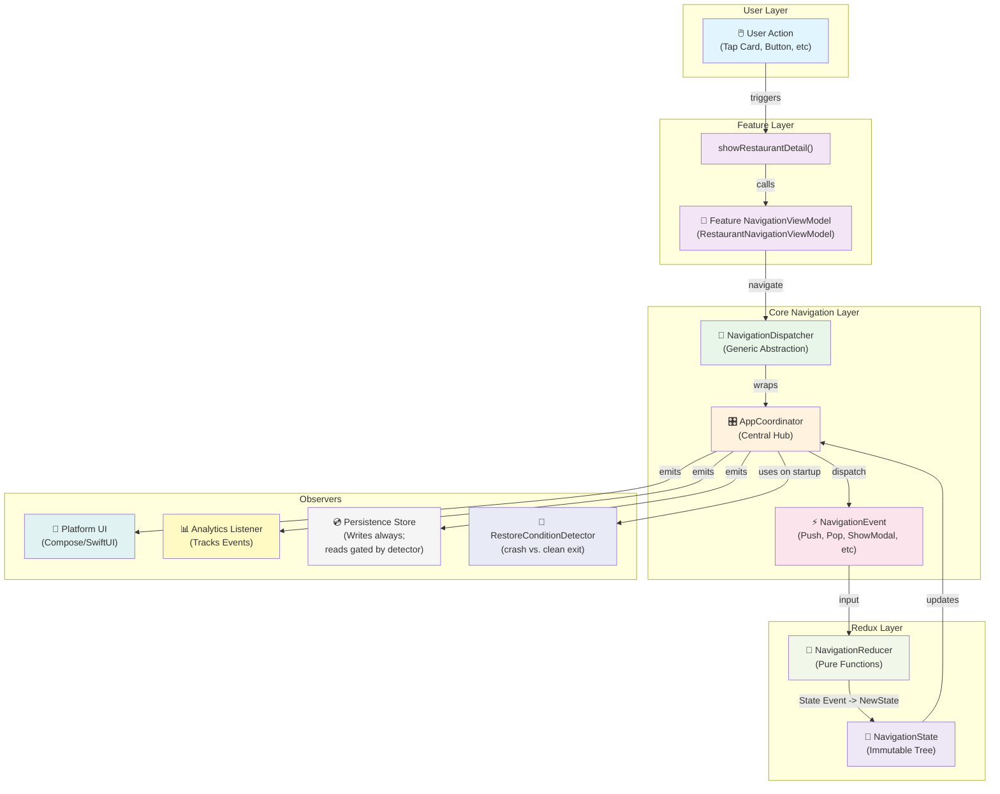

---

## Component Architecture

### Navigation Components Overview

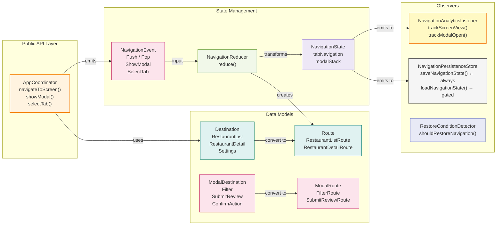

### Component Dependencies

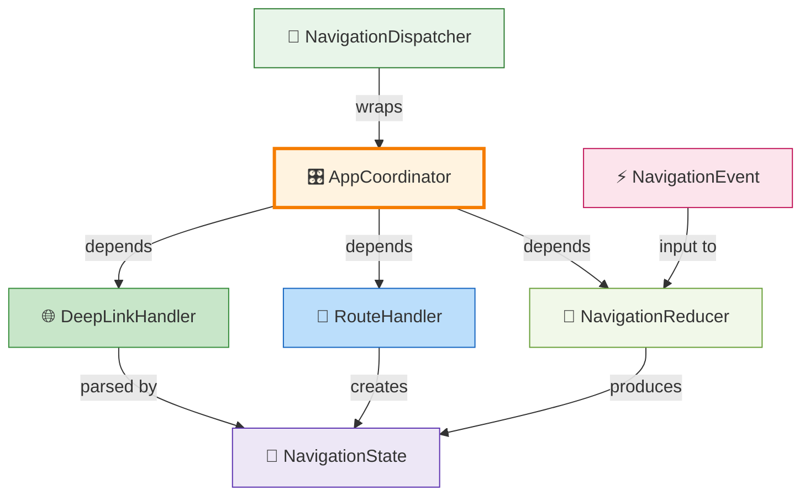

---

## Deep Link Flow

### Complete Deep Link Processing

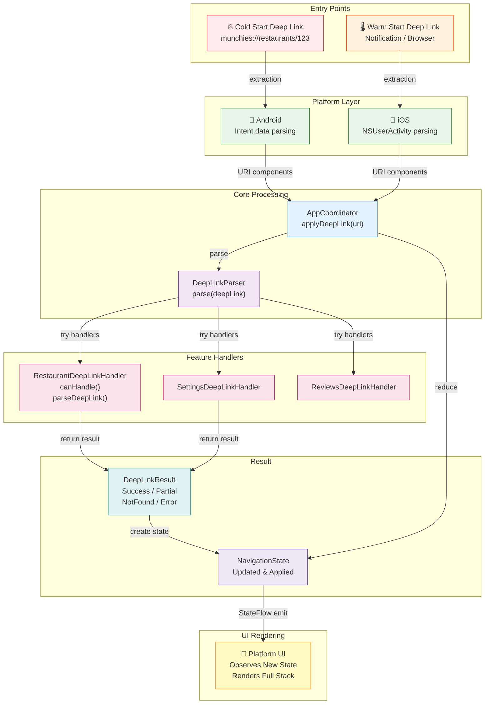

### Deep Link Parser Chain

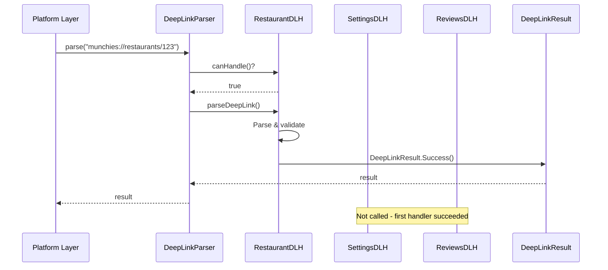

---

## Analytics Architecture

### Observer Pattern - Analytics Tracking

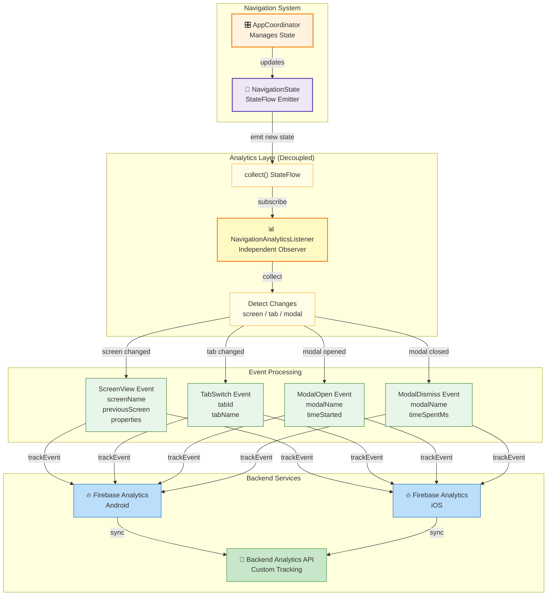

### Analytics Event Lifecycle

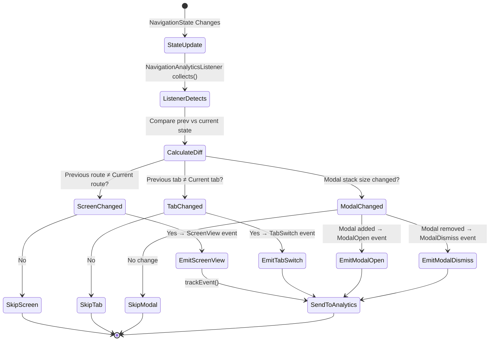

---

## Abstraction Layers

### Navigation ViewModel Layers

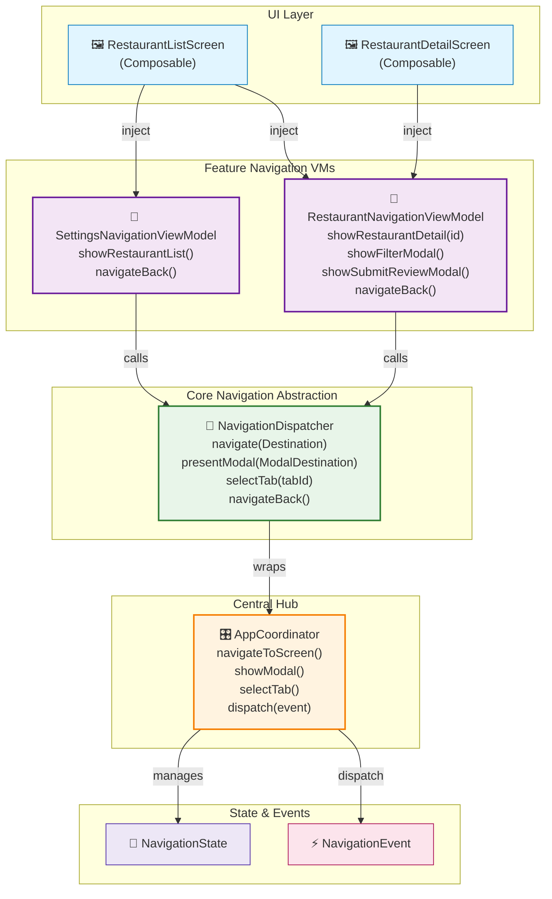

---

## State Structure

### NavigationState Tree

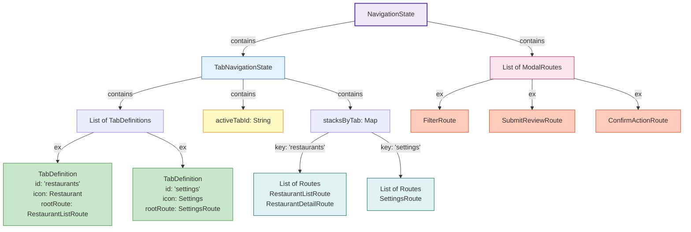

---

## Event Processing

### Redux Reducer Pattern

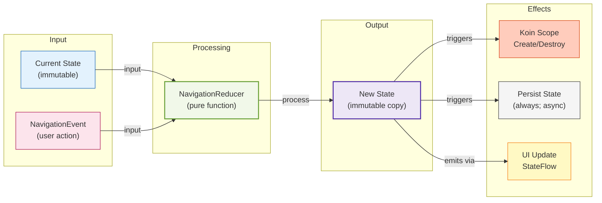

### Navigation Event Types

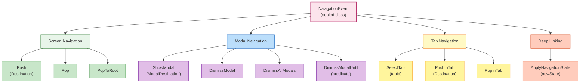

---

## Feature Integration

### Multi-Feature Navigation Architecture

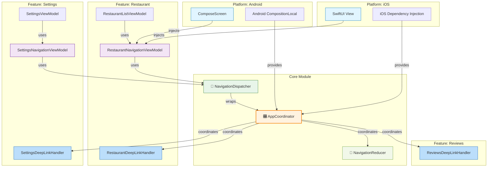

---

## Additional Diagrams

### Screen Navigation Lifecycle

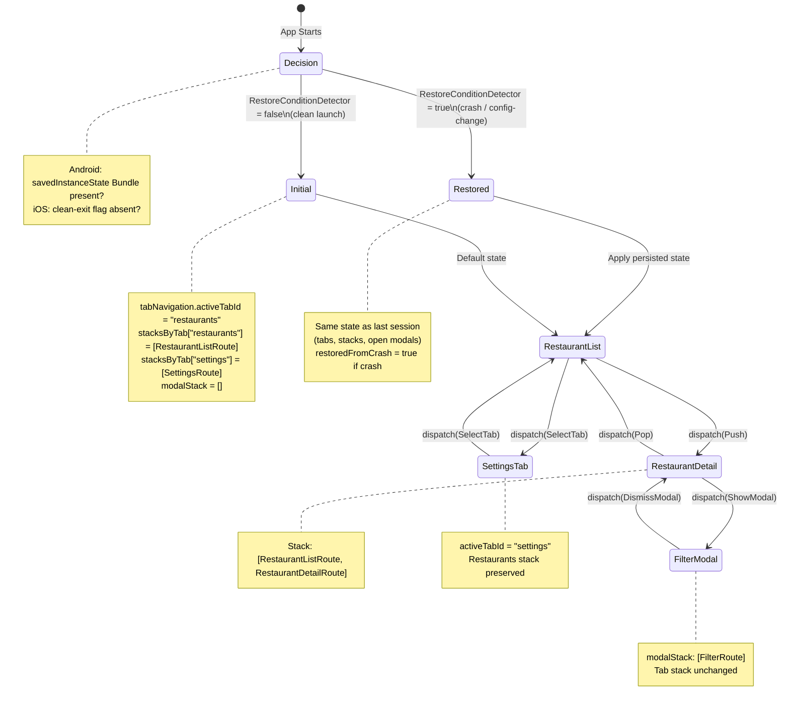

---

## Restoration Decision

### When to Restore vs. Start Fresh

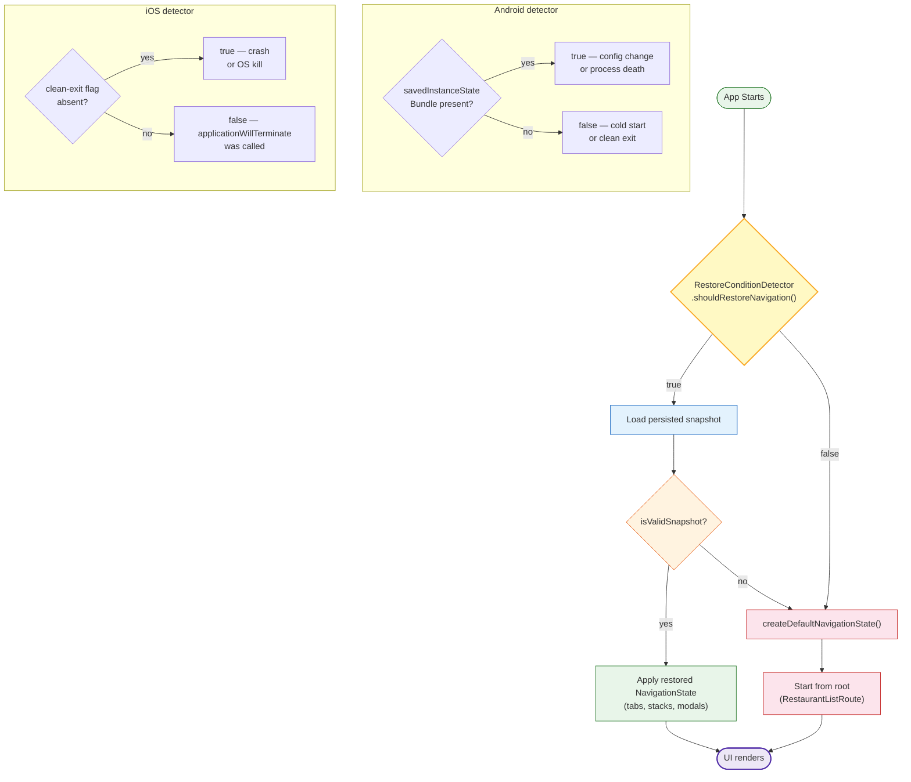

### Clean Exit Cleanup Flow

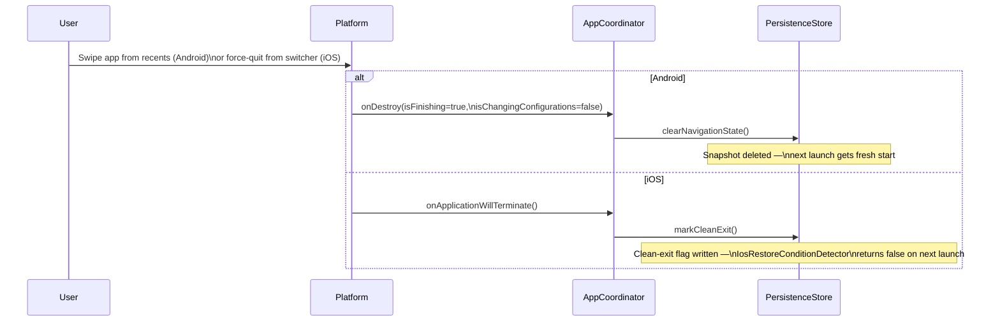

---

**End of Mermaid Diagrams Reference**
